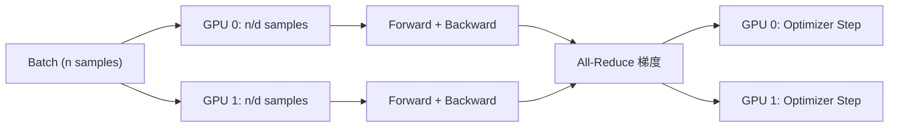
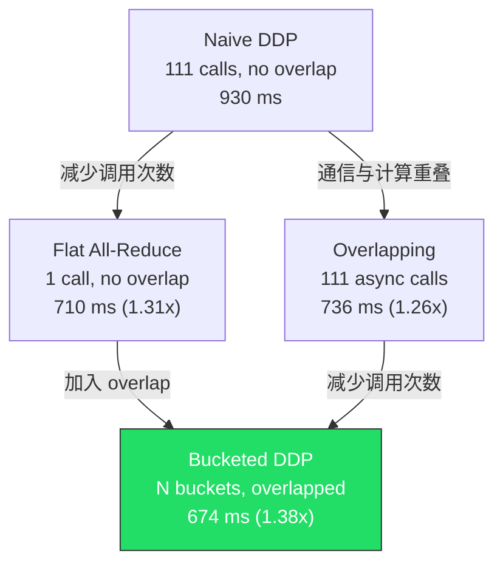

# FlashAttention & Distributed Data Parallel 笔记

## 目录

- [Part 1: FlashAttention](#part-1-flashattention)
  - [1.1 标准 Attention 的瓶颈](#11-标准-attention-的瓶颈)
  - [1.2 FlashAttention-2 Forward (PyTorch)](#12-flashattention-2-forward-pytorch)
  - [1.3 FlashAttention-2 Forward (Triton Kernel)](#13-flashattention-2-forward-triton-kernel)
  - [1.4 FlashAttention-2 Backward](#14-flashattention-2-backward)
- [Part 2: Distributed Data Parallel (DDP)](#part-2-distributed-data-parallel-ddp)
  - [2.1 DDP 的基本原理](#21-ddp-的基本原理)
  - [2.2 Naive DDP — 逐参数同步](#22-naive-ddp--逐参数同步)
  - [2.3 Flat All-Reduce — 减少通信调用次数](#23-flat-all-reduce--减少通信调用次数)
  - [2.4 Overlapping — 通信与计算重叠](#24-overlapping--通信与计算重叠)
  - [2.5 Bucketed DDP — 两全其美](#25-bucketed-ddp--两全其美)
  - [2.6 DDP 通信开销建模](#26-ddp-通信开销建模)
- [Benchmark 汇总](#benchmark-汇总)

---

## Part 1: FlashAttention

### 1.1 标准 Attention 的瓶颈

标准 self-attention 计算 $O = \text{softmax}(QK^T / \sqrt{d}) \cdot V$，需要 **显式物化** $N \times N$ 的注意力矩阵：

| 步骤 | 内存占用 | IO 操作 |
|------|---------|--------|
| $S = QK^T$ | $O(N^2)$ 写入 HBM | 读 Q,K → 写 S |
| $P = \text{softmax}(S)$ | $O(N^2)$ 读+写 HBM | 读 S → 写 P |
| $O = PV$ | 读 P 和 V | 读 P,V → 写 O |

**核心问题**：
1. **内存占用 $O(N^2)$**：序列长度 N=4096 时，注意力矩阵占 64MB/head（fp32），是内存中最大的 activation
2. **IO 瓶颈**：注意力矩阵反复在 HBM 和 SRAM 之间搬运，GPU 的算力利用率低（compute-bound → memory-bound）

> [!IMPORTANT]
> 从 memory profiling 中观察到：最大的内存分配来自 `torch.bmm(Q, K^T)` 产生的注意力矩阵，形状为 `(batch, num_heads, seq_len, seq_len)`，随序列长度**二次增长**。

### 1.2 FlashAttention-2 Forward (PyTorch)

**核心思想**：Tiling + Online Softmax，**永远不物化完整的 $N \times N$ 注意力矩阵**。

#### 算法流程

```
对每个 Q 的 tile (大小 B_q):
    初始化 O_i = 0, l_i = 0, m_i = -∞
    
    对每个 K/V 的 tile (大小 B_k):
        S_i = Q_i @ K_j^T / √d          ← 仅 B_q × B_k 大小的 tile
        m_i_new = max(m_i, rowmax(S_i))  ← 在线更新 softmax 分母
        P_i = exp(S_i - m_i_new)
        l_i = exp(m_i - m_i_new) * l_i + rowsum(P_i)
        O_i = exp(m_i - m_i_new) * O_i + P_i @ V_j
        m_i = m_i_new
    
    O_i = O_i / l_i                      ← 最终归一化
    L_i = m_i + log(l_i)                 ← 保存 logsumexp 供 backward 用
```

**关键点**：
- 每次只计算 $B_q \times B_k$ 大小的 $S$ tile，内存从 $O(N^2) \to O(B_q \cdot B_k)$
- **Online Softmax**：用 `m_i`（running max）和 `l_i`（running sum）增量计算 softmax，无需看到完整行
- 只保存 $O$ 和 $L = m + \log(l)$（logsumexp），**不保存 P 矩阵**

> [!TIP]
> 为什么能不保存 P？因为 backward 时可以用 Q, K, L **重新计算** P = exp(S - L)。用少量重计算换取巨大的内存节约，这就是 recomputation 策略。

#### 实现细节

```python
# flashattention2.py - forward
B_q = max(16, min(N_q, 64))   # tile 大小选择
B_k = max(16, min(N_k, 64))

# 保存用于 backward 的信息（不保存 P！）
ctx.save_for_backward(L, Q, K, V, O)
```

### 1.3 FlashAttention-2 Forward (Triton Kernel)

**为什么要用 Triton？** PyTorch 虽然能实现 FlashAttention 的算法逻辑，但无法直接控制 GPU 的 SRAM 和线程调度。Triton 可以：

| 特性 | PyTorch 实现 | Triton 实现 |
|------|------------|------------|
| SRAM 控制 | 无法直接控制 | `tl.load` 显式管理 |
| 线程并行 | 依赖编译器 | 手动设置 grid 和 tile |
| Kernel 融合 | 多次 HBM 读写 | 单个 kernel 完成 |
| 因果 mask | 额外矩阵操作 | 编译期常量 `tl.constexpr` |

#### Triton Kernel 结构

```python
@triton.jit
def flash_fwd_kernel(..., is_causal: tl.constexpr, D: tl.constexpr, ...):
    # 每个 program 处理一个 (batch, q_tile)
    batch_idx = tl.program_id(0)
    q_tile_idx = tl.program_id(1)
    
    # 在 SRAM 中完成所有计算
    for k_tile_idx in range(num_k_tiles):
        # 因果 mask: 编译时确定跳过条件
        if is_causal:
            if k_start > q_end:
                continue  # 整个 tile 被 mask，直接跳过
```

### 1.4 FlashAttention-2 Backward

**挑战**：标准 backward 需要 $P$ 矩阵（$N \times N$），但 forward 没有保存它。

**解决方案**：**重计算 (Recomputation)**。保存 logsumexp $L$，backward 时重建 $P$：

$$P = \exp(S - L), \quad S = QK^T / \sqrt{d}$$

#### Backward 的方程（Equations 13-19）

| 方程 | 公式 | 含义 |
|------|------|------|
| Eq 13 | $S = QK^T / \sqrt{d}$ | 重计算注意力分数 |
| Eq 14 | $P = \exp(S - L)$ | 用 logsumexp 重建概率 |
| Eq 15 | $dV = P^T \cdot dO$ | V 的梯度 |
| Eq 16 | $dP = dO \cdot V^T$ | 中间梯度 |
| Eq 17 | $dS = P \odot (dP - D)$ | S 的梯度，$D = \text{rowsum}(O \odot dO)$ |
| Eq 18 | $dQ = dS \cdot K / \sqrt{d}$ | Q 的梯度 |
| Eq 19 | $dK = dS^T \cdot Q / \sqrt{d}$ | K 的梯度 |

#### Triton Backward 的双 Kernel 策略

**为什么需要两个 kernel？** 因为 dK/dV 和 dQ 的外循环维度不同：

```
Kernel 1 (flash_bwd_kernel_KV): 外循环遍历 K/V tiles
    → 自然累加 dK, dV（每个 K tile 汇总所有 Q tiles 的贡献）
    → 但 dQ 需要原子操作（多个 K tile 同时写同一个 dQ），开销大

Kernel 2 (flash_bwd_kernel_Q): 外循环遍历 Q tiles
    → 自然累加 dQ（每个 Q tile 汇总所有 K tiles 的贡献）
```

这比单 kernel + 原子操作更快，虽然 P 矩阵被重计算了两次。

---

## Part 2: Distributed Data Parallel (DDP)

### 2.1 DDP 的基本原理

**目标**：多GPU上用更大的有效 batch size 训练，每个 GPU 只处理 $n/d$ 个样本。



**关键保证**：因为初始参数相同 + 梯度相同（all-reduce后）→ optimizer step 后参数仍然相同。

### 2.2 Naive DDP — 逐参数同步

**实现方式**：backward 完成后，对每个参数 tensor 逐一调用 `dist.all_reduce`。

```python
def finish_gradient_synchronization(self):
    for param in self.module.parameters():
        dist.all_reduce(param.grad, op=ReduceOp.SUM)
        param.grad /= world_size
```

**两个问题**：

> [!WARNING]
> 1. **通信调用次数过多**：111 个参数 tensor = 111 次 all-reduce 调用，每次调用都有固定开销 $o$
> 2. **无法与计算重叠**：必须等 backward 全部完成才开始通信，通信时间 100% 是额外开销

### 2.3 Flat All-Reduce — 减少通信调用次数

**要解决的问题**：每次 all-reduce 都有固定的 launch overhead $o$，111 次调用 = $111 \times o$ 额外开销。

**方法**：把所有梯度拼成一个大 tensor，只做 1 次 all-reduce。

```python
def finish_gradient_synchronization_flat(self):
    flat = _flatten_dense_tensors(all_grads)  # 拼成一个 tensor
    dist.all_reduce(flat)                      # 1 次调用
    # 拆回各参数的 grad
```

**效果**：通信调用从 111 次 → 1 次，减少了 per-call overhead。

| 方法 | 通信调用次数 | 缺点 |
|------|------------|------|
| naive | N 次 | 调用次数多 |
| flat | 1 次 | 必须等所有梯度就绪（无法overlap） |

### 2.4 Overlapping — 通信与计算重叠

**要解决的问题**：无论 naive 还是 flat，通信都发生在 backward **之后**，是纯额外开销。

**关键洞察**：Backward 是逐层计算的。当最后一层的梯度算完时，第一层还在算——可以**边算边传**！

**实现**：`register_post_accumulate_grad_hook` + `async_op=True`

```python
# __init__ 中注册 hook
param.register_post_accumulate_grad_hook(self._make_hook())

def _make_hook(self):
    def hook(param):
        # 梯度一就绪就立刻启动 async all-reduce
        handle = dist.all_reduce(param.grad, async_op=True)
        self._handles.append((handle, param))
    return hook

# backward 之后只需等待
def finish_gradient_synchronization(self):
    for handle, param in self._handles:
        handle.wait()           # 大部分已经完成了！
        param.grad /= world_size
```

**时间线对比**：

```
Naive:       [  Backward  ] [====== All-Reduce ======] [Opt]
                                 ↑ 纯开销

Overlapping: [  Backward  ←── 同时 All-Reduce ──→    ] [wait] [Opt]
                                                        ↑ 只等最后几个
```

### 2.5 Bucketed DDP — 两全其美

**要解决的问题**：Overlapping 解决了重叠问题，但仍然每个参数一次 all-reduce 调用（111 次）。Flat 只需 1 次但不能重叠。能否**既减少调用又能重叠**？

**方法**：把参数分成若干**桶 (bucket)**，每个桶最多 `bucket_size_mb` 大小。当一个桶内所有参数的梯度都就绪时，把它们拼起来做一次 async all-reduce。

```
参数（反向遍历）:  [p111] [p110] [p109] ... [p2] [p1]
                  |← Bucket 0 →|←  Bucket 1  →| ... |← Bucket N →|

Backward:  p111 梯度就绪 → p110 就绪 → bucket 0 满 → 🚀 async all-reduce
           p109 就绪 → p108 就绪 → ... → bucket 1 满 → 🚀 async all-reduce
           ...
```

**实现关键**：

```python
# 每个参数的 hook 递减所在桶的 pending 计数
def hook(param):
    self._bucket_pending[bucket_idx] -= 1
    if self._bucket_pending[bucket_idx] == 0:
        self._allreduce_bucket(bucket_idx)  # 桶满了就发射！

# 桶内梯度拼成一个 tensor 再 all-reduce
def _allreduce_bucket(self, bucket_idx):
    flat = _flatten_dense_tensors(bucket_grads)
    handle = dist.all_reduce(flat, async_op=True)
```

> [!TIP]
> 为什么按 **reverse order** 分桶？因为 backward 从最后一层开始算梯度，reverse order 保证同一个桶内的参数梯度**几乎同时就绪**，减少等待。

### 2.6 DDP 通信开销建模

假设：
- $s$：模型参数总大小（bytes）
- $w$：all-reduce 算法带宽（bytes/s）
- $o$：每次通信调用的固定开销（seconds）
- $n_b$：桶的数量
- 每个桶的计算时间 ≈ 通信时间（题目假设）

**DDP overhead**（backward 之后的额外等待时间）：

$$\text{overhead} = \frac{s}{n_b \cdot w} + o$$

> 最后一个桶在 backward 结束时才开始通信，需要完整的 $\frac{s / n_b}{w}$ 时间来完成 all-reduce，再加上一次调用开销 $o$。前面的桶都已经在 backward 期间完成了。

**最优桶大小**：令 $\frac{d(\text{overhead})}{d(n_b)} = 0$：

$$\frac{d}{dn_b}\left(\frac{s}{n_b \cdot w} + o\right) = -\frac{s}{n_b^2 \cdot w} = 0$$

这个模型下 overhead 关于 $n_b$ 单调递减，但受限于总通信时间不能小于 $\frac{s}{w}$，且每个桶有固定开销 $o$，所以考虑**总通信时间**：

$$T_{comm} = n_b \cdot o + \frac{s}{w}$$

overlap 能隐藏的通信 = $(n_b - 1)$ 个桶的通信时间，故：

$$\text{overhead} = \frac{s}{n_b \cdot w} + o$$

最优 $n_b$ 使得每个桶的通信时间 = 计算时间。设 $T_{compute} = T_{backward} / n_b$：

$$\frac{s}{n_b \cdot w} = \frac{T_{backward}}{n_b} \implies \text{自动满足}$$

但当 $n_b$ 过大时开销 $n_b \cdot o$ 增加。平衡点：

$$\text{optimal bucket size} = \sqrt{\frac{s \cdot o}{w}}$$

---

## Benchmark 汇总

实验配置：Small model (768-dim, 12 layers, 12 heads)，128.6M 参数，2 GPUs，gloo backend。

### Naive vs Flat（无 overlap）

| 方法 | Total (ms) | Comm (ms) | Comm% | vs naive |
|------|-----------|-----------|-------|----------|
| naive (111 calls) | 930.3 | 835.0 | 89.8% | 1.00x |
| flat (1 call) | 709.6 | 615.2 | 86.7% | **1.31x** |

> **结论**：仅减少通信调用次数就带来 31% 加速，说明 per-call overhead 很显著。

### 加入 Overlap

| 方法 | Total (ms) | Comm/Wait (ms) | Overhead% | vs naive |
|------|-----------|----------------|-----------|----------|
| naive | 930.3 | 835.0 | 89.8% | 1.00x |
| flat | 709.6 | 615.2 | 86.7% | 1.31x |
| overlap-individual | 735.5 | 638.9 | 86.9% | **1.26x** |

> **结论**：在 gloo backend 下 overlap 效果有限，因为 gloo 处理 GPU tensor 时需要 GPU→CPU→通信→CPU→GPU 拷贝，真正的 async 程度不高。在 NCCL backend 下预期 overlap 效果更显著。

### Bucketed DDP（不同桶大小）

| 方法 | 桶数 | Total (ms) | Wait (ms) | Overhead% | vs naive |
|------|------|-----------|-----------|-----------|----------|
| naive | 111 | 930.3 | 835.0 | 89.8% | 1.00x |
| flat | 1 | 709.6 | 615.2 | 86.7% | 1.31x |
| overlap-indiv | 111 | 735.5 | 638.9 | 86.9% | 1.26x |
| **bucket-1MB** | 111 | 808.7 | 712.1 | 88.0% | 1.15x |
| **bucket-10MB** | 50 | 700.3 | 603.2 | 86.1% | 1.33x |
| **bucket-100MB** | 6 | **673.6** | **573.3** | **85.1%** | **1.38x** |
| **bucket-1000MB** | 1 | 701.7 | 586.0 | 83.5% | 1.33x |

> [!IMPORTANT]
> **最优桶大小 ≈ 100MB**（6 buckets），实现了 overlap + batching 的最优平衡。
> - 桶太小 (1MB → 111 buckets)：退化为 overlap-individual，per-call overhead 过多
> - 桶太大 (1000MB → 1 bucket)：退化为 flat，无法 overlap
> - 中间值 (100MB → 6 buckets)：兼顾两者优势

### 方法演进总结


